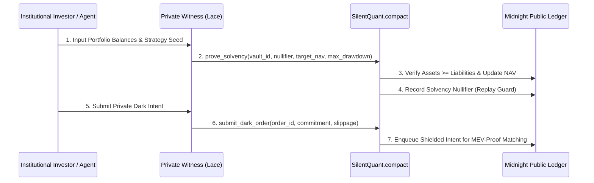

# SilentQuant Protocol — Pitch Presentation (Midnight Buildathon)

## Slide 1: Title & Overview
- **Project Name**: SilentQuant Protocol
- **Tagline**: Shielded DeFAI Strategy Vault & MEV-Proof Quantitative Execution Engine on Midnight Network
- **Track**: Midnight Buildathon — Privacy-Preserving DeFi & Financial Infrastructure
- **License**: Apache License 2.0
- **Smart Contract Language**: Midnight Compact 0.2

---

## Slide 2: The Core Problem
- **Alpha Decay**: On public blockchains, transparent order books and transparent vault balances leak quantitative trading strategies.
- **Toxic Flow & Front-Running**: Searchers and MEV bots copy profitable trades and front-run rebalancing transactions.
- **Proof of Solvency Dilemma**: Vault managers must prove they are solvent without doxxing proprietary positions and asset allocations.

---

## Slide 3: The SilentQuant Solution
- **Zero-Knowledge Proof of Solvency**: `prove_solvency()` circuit mathematically certifies Assets >= Liabilities and NAV accuracy without disclosing trading positions.
- **Shielded Dark Order Pool**: Orders enter the pool masked as cryptographic commitments `H(order || salt)`, eliminating MEV and toxic front-running.
- **Automated Circuit Breaker**: On-chain volatility guard trips vault into protective state during market dislocation without exposing user balances.

---

## Slide 4: Compact Dual-Ledger Architecture


---

## Slide 5: Compact 0.2 Circuits & Security Invariants
- **Circuit 1: `register_vault`**: Establishes new shielded strategy vault on public ledger.
- **Circuit 2: `prove_solvency`**: Enforces balance sheet equation with zero asset/liability disclosure.
- **Circuit 3: `submit_dark_order`**: Enqueues shielded order commitments.
- **Circuit 4: `trip_circuit_breaker`**: Algorithmic risk boundary protection.
- **Replay Protection**: Spent nullifier registry permanently blocks replayed solvency proofs.

---

## Slide 6: Live Product & Verification Demo
- **DApp Console**: Real-time algorithmic volatility monitor and dark order terminal.
- **Run Verification**:
  ```bash
  npm run verify:midnight
  ```
  Executes authentic cryptographic tests verifying zero leakage of asset allocations.

---

## Slide 7: Roadmap & Viability
- **Wave 1 (Current)**: Compact 0.2 circuit implementation, solvency prover, dark order queue.
- **Wave 2**: Atomic intent solver auctions, Midnight testnet multi-asset liquidity pools.
- **Wave 3 (Mainnet)**: Institutional custody integration, audited ZK compliance statements.

---

## Slide 8: Attribution & Team
- **Built for**: Midnight Network Buildathon
- **Repository Tag**: `midnightntwrk`
- **License**: Apache-2.0
