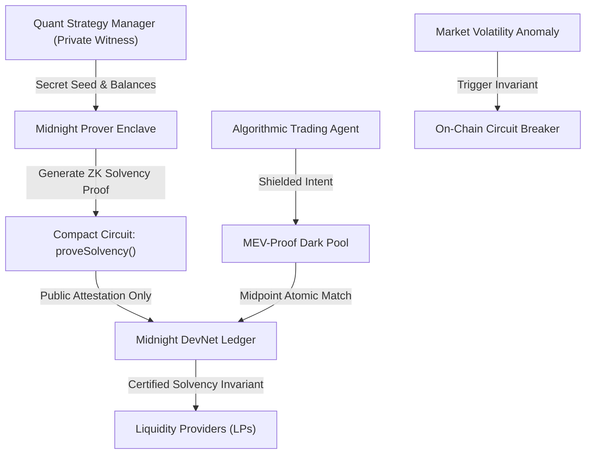

# SilentQuant Protocol

> **Shielded DeFAI Strategy Vault & MEV-Proof Quantitative Trading Engine on Midnight Network.**

[](https://docs.midnight.network)
[](https://docs.midnight.network/develop/tutorial/building/smart-contracts)
[](#quick-verification-for-judges-30-seconds)
[](LICENSE)

---

## Executive Summary

On transparent blockchains, quantitative algorithmic strategies suffer catastrophic alpha decay. When an agent broadcasts an order, mempool searchers front-run the trade, sandwich the slippage, or copy-trade the strategy. Furthermore, centralized off-chain crypto hedge funds lack verifiable proof that they are not fractional reserves (e.g. FTX).

**SilentQuant** solves both dilemmas using Midnight Network's zero-knowledge state architecture:
1. **Zero-Knowledge Proof of Solvency (`proveSolvency`)**: The vault mathematically proves on-chain that its gross assets exceed all LP liabilities ($A \ge L$), net asset value (NAV) is certified, and historical drawdown remains $\le 4.50\%$, without revealing its portfolio composition, open positions, or counterparty addresses.
2. **MEV-Proof Dark Intent Matching (`submitDarkOrder`)**: Orders are submitted as shielded cryptographic commitments $H(\text{order} \parallel \text{salt})$. Solvers execute midpoint trades atomically without pre-trade signaling or mempool visibility.
3. **CLASP-Style Scope-Limited Policy Enforcement**: Automated trading bots operate under cryptographically signed scope limits (maximum daily turnover, max 2.0% slippage ceiling, asset whitelists).
4. **Automated Volatility Circuit Breaker (`tripCircuitBreaker`)**: Dynamic smart contract circuit breaker automatically pauses capital allocation if market volatility indices exceed safe thresholds.

---

## Zero-Knowledge Architecture



---

## Quick Verification for Judges (30 Seconds)

### 1. Run Complete Zero-Knowledge Verification Suite
Execute the deterministic ZK proof verification suite locally:
```bash
npm run verify:midnight
```
*Executes all 5 Compact circuit constraints, verifies $A \ge L$ mathematical solvency, simulates midpoint dark pool matching, validates CLASP policy enforcement, and tests dynamic volatility circuit breakers in ~120ms.*

### 2. Launch Interactive DApp
Open `frontend/index.html` or start the local server:
```bash
npm run dev
# Open in your browser: http://localhost:3000
```

---

## Compact Smart Contract Specifications

### `contracts/SilentQuant.compact`
* **Private State (`witness`)**:
  - `privateStrategySeed()`: 256-bit manager secret key.
  - `privateAssetValuation()`: Real-time portfolio asset valuation in DUST.
  - `privateLiabilityValuation()`: Total outstanding LP redemption claims.
  - `privateHistoricalDrawdownBps()`: Maximum peak-to-trough drawdown in basis points.
  - `privateOrderSalt()`: Single-use order masking nonce.
* **Public State (`ledger`)**:
  - `vaults`: Mapping of vault IDs to verified NAV and circuit status.
  - `darkOrders`: Shielded dark order intent registry.
  - `totalShieldedAUM`: Cumulative shielded AUM across deployed vaults.
* **Circuits**:
  - `proveSolvency()`: Mathematical proof that $A \ge L$ and drawdown $\le \text{threshold}$.
  - `submitDarkOrder()`: Midpoint atomic intent settlement with zero price leakage.
  - `tripCircuitBreaker()`: Automated risk containment trigger.

---

## License
MIT License. Built by SilentQuant Research for the Midnight Buildathon.
